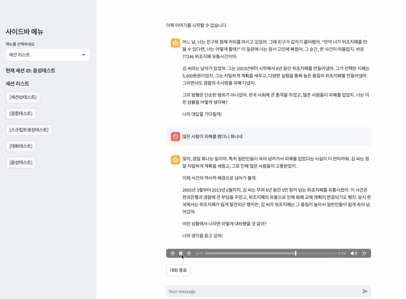
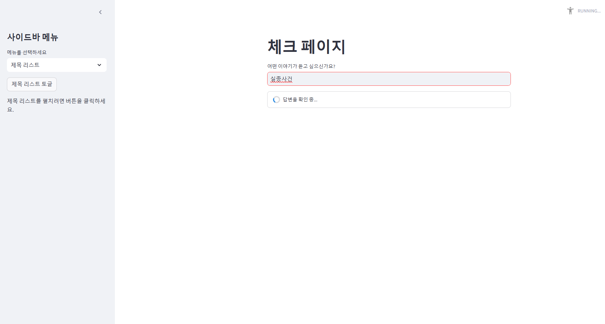
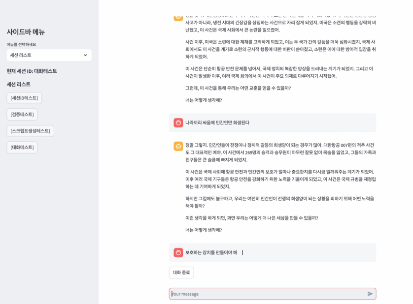
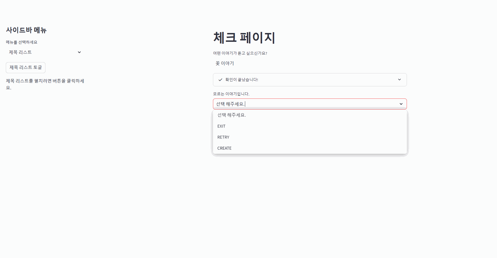
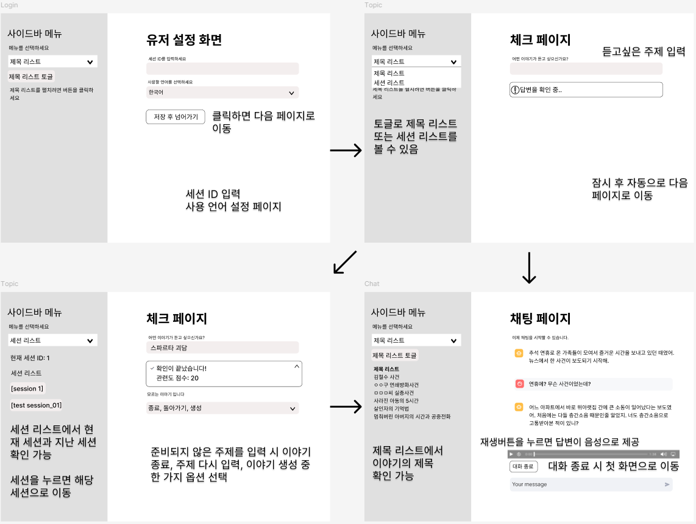

# 프로젝트 소개


이 프로젝트는 **사용자의 입력**을 기반으로 JSON 파일에 저장된 이야기 데이터를 활용하여 대화를 이끌어가는 **토크쇼 호스트** 같은 역할의 대화형 챗봇입니다.  
사용자에게 "어떤 이야기가 듣고 싶으신가요?"라는 질문을 던지고 챗봇이 해당 주제를 바탕으로 이야기를 진행하며 사용자와 상호작용 합니다.

---
## 팀 소개
**멤버**
- 공유라
    - 데이터셋 준비
    - 프론트앤드 개발
- 나영웅
    - 모델 로직 구현 
- 박수호
    - 모델 로직 구현
    - 데이터셋 준비
---
## 주요 기능

- **이야기 탐색 및 제공**:
  - 웹페이지 크롤링 데이터로 다양한 주제의 이야기를 제공
  - 사용자의 입력에 맞는 이야기를 검색하고 적합한 응답을 생성
  <details><summary>크롤링 사이트 선정</summary>

  | 항목          | 위키피디아                                            | 나무위키                                             |
  |---------------|-----------------------------------------------------|-----------------------------------------------------|
  | **크롤링 허용** | 허용 (API와 robots.txt를 통해 공식 지원)                | 제한적 (크롤링 금지 설정, API 없음)                      |
  | **라이선스**   | CC BY-SA 3.0 (상업적 사용 허용)                        | CC BY-NC-SA 2.0 (비상업적 사용만 허용)                  |
  | **상업적 활용** | 출처 표시 및 동일 조건 공유 시 가능                       | 불가능 (라이선스 위반)                                   |
  | **접근성**     | 오픈 데이터 (공익적 접근성)                              | 사용자 커뮤니티 중심, 제한적 접근성                         |
  
   접근성이 좋고 크롤링을 허용하는 위키피디아를 사용
  </details>


- **질문 유도**:
  - 챗봇이 사용자의 반응을 분석하여 적절한 질문과 응답을 생성
  <details><summary>gpt-4o vs gpt-4o-mini</summary>

  | 항목                  | **GPT-4.0**                            | **GPT-4.0 Mini**                     |
  |-----------------------|-----------------------------------------|---------------------------------------|
  | **모델 크기**          | 대형 모델 (매우 많은 매개변수)          | 경량 모델 (축소된 매개변수)            |
  | **성능**              | 최상위 성능, 높은 정확도                 | 적당한 성능, 빠른 추론 속도            |
  | **응답 속도**          | 상대적으로 느림                         | 더 빠름                                |
  | **리소스 요구 사항**    | 고사양 하드웨어 필요 (GPU 메모리 등)     | 저사양 환경에서도 동작 가능             |
  | **학습 데이터 크기**    | 방대한 데이터 사용                      | 상대적으로 작은 데이터 세트로 학습      |
  | **비용**              | 높은 비용 (클라우드 사용 시)             | 더 저렴한 비용                          |

  크롤링한 데이터의 크기가 크지 않기 때문에 응답속도와 비용을 고려하여 gpt-4o-mini 모델을 선택   
  최대 5초 이내 응답
  </details> 

- **이야기 생성 기능**:
  - 사용자가 제공한 URL이나 텍스트를 바탕으로 새로운 이야기를 생성 및 저장

- **텍스트 음성 출력 기능**
    - 텍스트를 음성으로 들려주어 몰입도 향상 및 사용자 편의 증가
    
- **대화 히스토리 관리**:
  - langchain을 사용하여 대화 맥락을 기억하고 유지하여 자연스러운 대화를 이어나감
  <details><summary>langchain의 특징</summary>

  장점
  - 대화 맥락 유지: 사용자의 대화를 기억하고, 자연스럽고 일관된 대화 흐름을 제공
  - 다양한 데이터 소스 통합: 외부 데이터베이스, API, 문서를 연동해 실시간으로 데이터를 활용 가능
  - 맞춤형 응답: 사용자 정보를 기반으로 개인화된 답변과 서비스를 제공
  - 복잡한 작업 처리: 멀티턴 대화와 조건 기반 논리를 처리하여 복잡한 요구사항도 해결
  - 확장성: 메모리 관리, 추론, 검색 등 모듈화된 설계를 통해 다양한 애플리케이션에 쉽게 적용 가능
  
  단점
  - 실시간으로 대량의 데이터를 처리하기 어려움
  - 대화가 길어질 경우 잘못된 대화 흐름으로 가거나 부정확한 응답 발생
  </details>
---


## 설치 및 실행방법

### 1. Python 버전
- Python 3.8.20 이상이 필요합니다.

### 2. 프로젝트 클론
프로젝트를 로컬 환경으로 복사합니다:
``` bash
git clone https://github.com/AI-8th-11m/11m-jira
```

### 3-1. 가상환경 생성 및 활성화 (macOS/Linux)
```
python -m venv venv
source venv/bin/activate
```

### 3-2. 가상환경 생성 및 활성화 (Windows)
```
python -m venv venv
venv\Scripts\activate
```

### 4. 필요 라이브러리 설치
```
pip install -r requirements.txt
```

### 5. 챗봇 실행
```
streamlit run app_mk3.py
```
streamlit 서버가 실행되면 브라우저에서 챗봇과 대화를 시작할 수 있습니다.

---

## 개발기간
- 2024.11.21(목)~2024.12.4(수)

---
## 기술스택
- **language**: Python 3.8.20
- **version control**: Github
- **IDE**: Visual Studio Code
- **Framework**: Streamlit(UI), Langchain(대화흐름 관리)
- **DBMS**: ChromaDB(벡터 데이터베이스)
---
## Key summary
- **이야기를 들려주는 챗봇**        
  - 단순 요약이 아닌, 이야기를 실제로 전달하는 것처럼 동작
  - 긴 이야기를 적절히 요약    
  - 없는 정보를 지어서는 안 됨        

- **사용자와 상호작용하는  챗봇**
  - 사용자의 반응을 이끌어냄     
  - 사용자의 반응에 적절하게 대응함    

---
## 서비스 구조
- **시나리오1**
1. 사용자가 특정 이야기를 요청
2. 데이터베이스(ChromaDB)에서 유사한 이야기를 검색
3. 검색한 이야기의 관련성 점수를 확인
    - 관련성 점수 80점 미만: 대화종료, 주제 다시 요청, 또는 새로운 이야기 생성 제안
    - 관련성 점수 80점이상 95점 미만: 사용자에게 더 구체적인 정보 요청
    - 관련성 점수 95점 이상: 해당 이야기 제공

- **시나리오2**
1. 사용자가 아무거나 또는 재미있는 이야기를 요청
2. 데이터베이스(ChromaDB)에 저장된 이야기 중 랜덤으로 선택

- **시나리오3**
1. 사용자가 새로운 이야기 또는 이야기 창조를 요청
2. 사용자에게 URL 또는 텍스트를 입력받아 관련된 이야기를 생성
3. 생성한 이야기는 chromaDB에 저장 

- **공통사항**
1. 스크립트 생성 및 이야기 진행
2. 사용자에게 질문 및 반응 유도
3. 대화 내용을 저장해 맥락 유지

---
## 주요 모듈 설명

요약

| **모듈**            | **기능 요약**                                                                                             | **주요 역할**                                                                                      |
|---------------------|---------------------------------------------------------------------------------------------------------|--------------------------------------------------------------------------------------------------|
| **docs_utils**      | JSON 파일에서 데이터를 읽어와 전처리하고 필요한 데이터를 통합.                                            | 문서 전처리 및 데이터 필터링을 통해 RAG 기반 검색에 최적화된 형태로 변환.                             |
| **db_utils**        | Chroma DB 생성, 불러오기, 데이터 추가.                                                                    | 벡터 DB 관리 및 검색을 통해 관련 문서 또는 스크립트를 효율적으로 검색.                                 |
| **script_utils**    | 사용자 입력 데이터를 바탕으로 스크립트를 생성하고 저장.                                                    | LLM을 활용해 소설 구성 형식의 스토리 스크립트 생성 및 DB에 저장.                                       |
| **llm_utils**       | LLM과의 대화를 위한 메모리 관리 및 대화 흐름 유지.                                                        | 대화 맥락 유지, 사용자 입력 평가, LLM과의 상호작용.                                                 |
| **translator_module** | 다국어 번역 지원.                                                                                      | 텍스트 번역 기능을 통해 여러 언어로 대화 지원.                                                       |
| **voice_outpt_model**|텍스트 음성을 생성 및 출력                                                                                |사용자에게 음성을 제공하여 몰입도 향상 및 사용자 범위 확대
| **Streamlit App**   | 사용자 인터페이스 구현 및 페이지 이동 관리.                                                               | 설정, 체크, 생성, 채팅, 세션 관리 페이지를 통해 앱의 흐름을 컨트롤.                                    |
| **Conversation Memory** | 대화 내용을 Session State 또는 LangChain 메모리에 저장.                                               | 대화 히스토리와 컨텍스트를 기반으로 연속적인 대화 경험 제공.                                           |
| **Chroma DB**       | 벡터 검색을 위한 데이터베이스 관리.                                                                       | 검색 정확도를 높이기 위해 문서 데이터를 벡터화하여 저장 및 검색.                                       |


<details><summary>상세</summary>

- 프론트앤드
  <details><summary>DB 및 데이터 세팅</summary>

  - 지속적으로 업데이트 되어야 하기 때문에 `session.state`에 저장하지 않음
  - **App**이 새로고침 될 때마다 로컬 **DB**에서 정보를 받아 데이터를 업데이트

  ```py
  json_files = [
      "./llm_chatbot/documents/filtered_unsolved_cases.json",
      "./llm_chatbot/documents/korea_crime.json",
  ]
  titles = title_json_data(json_files)
  sample_titles = titles[0:51]
  path = "./llm_chatbot/db/script_db"
  db_name = "script_db"
  script_db = load_vstore(db_name, path)
  ```

  </details>

  <details><summary>세션 세팅</summary>

  - 최초 상태를 설정 : 리스트, 딕셔너리 또는 기본값
  - 앱이 동작하는 동안 유지될 정보들 보관
    - 세션 **ID** : 현재 및 저장된 **ID**
    - 제목 리스트 토글 상태 : 사이드 바에 위치하기 떄문에, 열리고 닫힌 상태가 유지되어야 함
    - 대화 맥락 : 세션 **ID**를 **KEY**로 대화 내용, 사용 스크립트 저장

  ```py
  if "session_list" not in st.session_state:
      st.session_state["session_list"] = []
  if "current_session_id" not in st.session_state:
      st.session_state["current_session_id"] = "no session id"
  if "title_list_expanded" not in st.session_state:
      st.session_state["title_list_expanded"] = False
  if "conversation" not in st.session_state:
      st.session_state["conversation"] = {}
  ```

  </details>

  <details><summary>사이드 바</summary>

  - 제목 리스트 : **DB**에 존재하는 스크립트 리스트
    - 내용이 많기 떄문에 토글로 열고 닫아 관리
  - 세션 리스트 : 생성된 세션 리스트
    - 최상단에는 현재 세션 표시
    - 세션 **ID**가 등록되면 자동으로 추가
    - 클릭하면 세션 **ID** 의 대화 페이지로 이동

  ```py
  if main_option == "제목 리스트":

      toggle_button = st.sidebar.button("제목 리스트 토글")
      if toggle_button:
          st.session_state["title_list_expanded"] = not st.session_state[
              "title_list_expanded"
          ]

      if st.session_state["title_list_expanded"]:
          st.sidebar.subheader("제목 리스트")
          for title in sample_titles:
              st.sidebar.write(title)
      else:
          st.sidebar.write("제목 리스트를 펼치려면 버튼을 클릭하세요.")

  elif main_option == "세션 리스트":
      st.sidebar.subheader(f"**현재 세션 ID:** {st.session_state['current_session_id']}")
      st.sidebar.subheader("세션 리스트")
      session_list = st.session_state.get("session_list")
      for session in session_list:
          if st.sidebar.button(f"[{session['id']}]"):
              st.session_state.session_id = session["id"]
              st.session_state["current_session_id"] = session["id"]
              st.session_state.page = "session_page"
              st.rerun()
  ```

  </details>

  <details><summary>세팅 페이지</summary>

  - 함수로 페이지 구분
  - 세션 **ID** 및 언어를 설정
    - 대화 종료시 까지 유지
    - 저장하면 사이드 바에 반영
    - 저장하지 않으면 다음 단께로 넘어가지 않도록 조치

  ```py
  def setting_page():
      st.title("유저 설정 화면")

      # 세션 ID와 언어 설정
      session_id = st.text_input("세션 ID를 입력하세요", placeholder="예: session123")
      language = st.selectbox(
          "사용할 언어를 선택하세요", options=["한국어", "English", "日本語"]
      )

      if st.button("저장 후 넘어가기"):
          if session_id:
              # 세션 정보 저장
              st.session_state.session_id = session_id
              st.session_state["current_session_id"] = session_id
              st.session_state["session_list"].append({"id": session_id})
              st.session_state.LANG = language
              st.session_state.current_session = session_id
              st.session_state.page = "check"  
              st.rerun()
          else:
              st.warning("세션 ID를 입력해주세요!")

  ```
  </details>

  <details><summary>체크 페이지</summary>

  - 기존 `While` 반복문으로 작성된 코드를 각 페이지로 분기시킴
  - 답변 검증 및 분기 기능
  - 사용자 입력과 검색된 스크립트의 연관성을 분석하여 페이지 분기
    - 종료 : 세팅 페이지로 이동
    - 돌아가기 : 추가적인 설명 요구 후 초기화
    - 생성하기 : 생성 페이지로 이동

  ```py
  MIN_SCORE = 80
  MAX_SCORE = 85
  NEXT_SCORE = 95

  # 초기 점수 설정
  if "score" not in st.session_state:
      st.session_state.score = 0

  def check_page():
      st.title("체크 페이지")
      query = st.text_input("어떤 이야기가 듣고 싶으신가요?", placeholder="예 : 아무거나")

      if query:
          with st.status("답변을 확인 중...", expanded=True) as status:
              if query is None or "아무거나" in query.strip():
                  st.write("재미난 이야기를 가져오는 중...")
                  choice = random.choice(sample_titles)
                  query = choice
              relavence = evaluator(query, script_db)
              st.write(f"관련도 점수: {relavence[0]}")
              st.session_state.score += relavence[0]
          status.update(label="확인이 끝났습니다!", state="complete", expanded=False)

          if relavence[0] < 80:
              query = st.selectbox("모르는 이야기입니다.", options= ['종료, 돌아가기, 생성하기', "exit", "retry", "create"])
              if query.lower() == "exit":
                  st.session_state.page = "settings"
                  st.rerun()
              elif query.lower() == "retry":
                  query = st.text_input("더 자세히 설명해 주세요.", placeholder="예 : 강다니엘 이모 사건")
                  if query:
                      st.rerun()
              elif query.lower() == "create":
                  st.session_state.page = "create"
                  st.rerun()

          elif relavence[0] < 95 and relavence[0] >= 80:
              st.write("더 자세히 이야기 해주세요.")
              st.rerun()

          elif relavence[0] >= 95:
              script = relavence[1]
              st.session_state.page = "chat"
              st.session_state.query = query
              st.session_state.script = script
              time.sleep(1)
              st.rerun()
  ```
  </details>

  <details><summary>생성 페이지</summary>

  - 사용자가 제공한 데이터로 새로운 스크립트 형성
  - **DB**에 반영 여부 묻기
  - 스크립트가 생성되는 동안 안내 메시지 출력

  ```py
  def create_page():
      st.title("생성 페이지")
      st.write("새로운 스크립트를 입력할 수 있습니다.")

      if st.button("돌아가기"):
          st.session_state.page = "check"
          time.sleep(1)
          st.rerun()

      text_input = st.text_area("URL 또는 텍스트를 입력해주세요.")
      if text_input:
          with st.status("스크립트를 생성중입니다...", expanded=True) as status:
              st.write("작가가 문서를 읽어보는 중...")
              time.sleep(2)
              st.write("스크립트를 작성하는 중...")
              time.sleep(2)
              st.write("창작의 고통을 느끼는 중...")
              new_script = script_maker(text_input)
              st.write(f"생성된 스크립트: {new_script}")
              time.sleep(2)
              status.update(
                  label="작업이 종료되었습니다.", state="complete", expanded=False
              )
          user_input = st.selectbox("DB에 저장하시겠습니까?", options= ['아니오', '예'])
          if user_input == '예':
              script_db = load_vstore("script_db", "./llm_chatbot/db/script_db")
              add_to_vstore(new_script, script_db)
  ```

  </details>

  <details><summary>채팅 페이지</summary>

  - 기존 메모리 :`langchain` 의 `ChatMessageHistory`
  - 변경 메모리 : `st.session_state`를 두개로 나눠 저장
    - `messages` : 대화가 진행되는 동안만 맥락을 저장
    - `conversation` : 대화가 끝난 뒤 세션 **ID** 를 키로 대화내용, 사용 스크립트 저장

  ```py
  def chat_page(script):
      st.title("채팅 페이지")
      st.write("이제 채팅을 시작할 수 있습니다.")
      ID = st.session_state.get("session_id")
      LANG = st.session_state.get("LANG")
      QUERY = st.session_state.get("query")
      if "messages" not in st.session_state:
          init_history = [{"role": "assistant", "content": "no history yet"}]
          chain = streamlit_chain(script, init_history, LANG)
          init_response = chain.invoke(
              {"question": QUERY},
              config={"configurable": {"session_id": ID}},
          )
          st.session_state["messages"] = [{"role": "assistant", "content": init_response}]

      for msg in st.session_state.messages:
          st.chat_message(msg["role"]).write(msg["content"])

      if prompt := st.chat_input():
          if prompt.lower() == "exit":
              st.write("대화를 종료합니다.")
              st.session_state["conversation"][f"{ID}_history"] = st.session_state["messages"]
              st.session_state["conversation"][f"{ID}_script"] = script
              del st.session_state["messages"]
              st.session_state.page = "settings"
              st.rerun()

          # elif LANG_CODE:
          #     prompt = translator(prompt, LANG_CODE)

          st.session_state.messages.append({"role": "user", "content": prompt})
          prompt = stream_data(prompt)
          st.chat_message("user").write_stream(prompt)

          history = st.session_state["messages"]
          chain = streamlit_chain(script, history, LANG)
          msg = chain.invoke(
              {"question": prompt},
              config={"configurable": {"session_id": ID}},
          )
          st.session_state.messages.append({"role": "assistant", "content": msg})
          msg = stream_data(msg)
          st.chat_message("assistant").write_stream(msg)

      if st.button("대화 종료"):
          st.session_state.page = "messages"
          st.session_state["conversation"][f"{ID}_history"] = st.session_state["messages"]
          st.session_state["conversation"][f"{ID}_script"] = script
          del st.session_state["messages"]
          st.session_state.page = "settings"
          time.sleep(1)
          st.rerun()
  ```
  </details>

  <details><summary>세션 페이지</summary>

  - 세션 **ID** 를 키로 대화 내용과 스크립트를 호출
  - 대화를 이어가거나, 이전 대화 내용을 확인 가능
  - 저장된 내용이 없는 경우 체크 페이지로 하도록 바이패스 설정

  ```py
  def session_page():
      ID = st.session_state["session_id"]
      LANG = st.session_state.get("LANG")
      st.title(f"{ID}페이지")
      st.write("다시 채팅을 시작할 수 있습니다.")

      if f"{ID}_history" not in st.session_state["conversation"]:
          st.session_state.page = "check"
          st.rerun()

      st.session_state["messages"] = st.session_state["conversation"][f"{ID}_history"]
      script = st.session_state["conversation"][f"{ID}_script"]

      chain = streamlit_chain(script, st.session_state["messages"], LANG)

      for msg in st.session_state.messages:
          st.chat_message(msg["role"]).write(msg["content"])

      if prompt := st.chat_input():
          if prompt.lower() == "exit":
              st.write("대화를 종료합니다.")
              st.session_state.page = "settings"
              st.rerun()

          # elif LANG_CODE:
          #     prompt = translator(prompt, LANG_CODE)

          st.session_state.messages.append({"role": "user", "content": prompt})
          prompt = stream_data(prompt)
          st.chat_message("user").write_stream(prompt)

          msg = chain.invoke(
              {"question": prompt},
              config={"configurable": {"session_id": ID}},
          )
          st.session_state.messages.append({"role": "assistant", "content": msg})
          msg = stream_data(msg)
          st.chat_message("assistant").write_stream(msg)

      if st.button("대화 종료"):
          st.session_state.page = "messages"
          st.session_state["conversation"][f"{ID}_history"] = st.session_state["messages"]
          st.session_state["conversation"][f"{ID}_script"] = script
          del st.session_state["messages"]
          st.session_state.page = "settings"
          time.sleep(1)
          st.rerun()
  ```
  </details>

  <details><summary>페이지 설정</summary>

  - 페이지 세션을 변경하여 페이지를 호출하도록 설정
  - 기본 페이지는 세팅 페이지로 이동하도록 설정

  ```py
  if "page" not in st.session_state:
      st.session_state.page = "settings"

  if st.session_state.page == "settings":
      setting_page()
  elif st.session_state.page == "check":
      check_page()
  elif st.session_state.page == "create":
      create_page()
  elif st.session_state.page == "chat":
      chat_page(st.session_state.script)
  elif st.session_state.page == "session_page":
      session_page()
  ```
  </details>

- 벡앤드

  <details><summary>docs_utils</summary>

  - 문서 전처리 기능

  ### 패키지 관리

  ```py
  import os
  import json
  import openai
  from openai import OpenAI
  from langchain_openai import ChatOpenAI
  from langchain_core.documents import Document
  from langchain_core.prompts import ChatPromptTemplate
  from langchain.memory import ConversationSummaryMemory
  from langchain_core.output_parsers import StrOutputParser
  from langchain.text_splitter import RecursiveCharacterTextSplitter
  ```

  ### `def process_json_data(json_files):`
  - 여러 JSON 파일을 읽고 데이터를 통합한 후 특정 형식의 문자열 리스트로 반환
  - **Parameters**: `json_files` `(list)`: `JSON` 파일 경로 리스트
  - **Returns**: 파일 데이터에서 `title`과 `content`를 읽어 특정 형식으로 변환한 리스트
    - `title` 이 본문에 포함되어야 **RAG** 검색에 용이

  ```py
  all_json_data = []
  for file_path in json_files:
      try:
          with open(file_path, "r", encoding="utf-8") as file:
              data = json.load(file)
              all_json_data.extend(data)
      except FileNotFoundError:
          print(f"Error: 파일을 찾을 수 없습니다 - {file_path}")
      except json.JSONDecodeError:
          print(f"Error: JSON 파일 형식이 잘못되었습니다 - {file_path}")

  return [
      f"Title: {item.get('title', 'N/A')}\nContent: {item.get('content', 'N/A')}"
      for item in all_json_data
  ]
  ```

  ### `def title_json_data(json_files):`
  - 여러 JSON 파일을 읽고 데이터를 통합한 후 특정 형식의 문자열 리스트로 반환
  - **Parameters**: json_files (list): JSON 파일 경로 리스트
  - **Returns**: 파일 데이터에서 `title`만 읽어 반환
    - 데이터 인덱스로 사용될 제목 목록 추출

  ### `def documents_filter(SPLITS):`
  - 분할된 데이터에서 불필요한 데이터를 제거하고 하나로 결합
  - `ConversationSummaryMemory`에 이전 내용을 요약하여 저장
  - 아전 내용과 대조해서 불필요한 데이터 구분
  - **Parameters**: 분할된 텍스트 데이터
  - **Returns**: 텍스트 데이터

  ```py
  llm = ChatOpenAI(
      model="gpt-4o-mini",
      api_key=openai.api_key,
      max_tokens=1000,
      temperature=0.0,
  )
  summaries = []
  memory = ConversationSummaryMemory(llm=llm, return_messages=True)

  count = 0
  for SPLIT in SPLITS:
      SPLIT = SPLIT.page_content

      try:
          context = memory.load_memory_variables({})["history"]
          prompt = ChatPromptTemplate.from_template(
              """
              persona : documents filter
              language : only in korean
              extract the parts related to the context and ignore the rest,
              write blanck if it's not relevant,
              
              <context>
              {context}
              </context>
                  
              <docs>
              {SPLIT}
              </docs>
              """
          )
          chain = prompt | llm | StrOutputParser()
          summary = chain.invoke({"SPLIT": SPLIT, "context": context})
          memory.save_context({"input": f"summary # {count}"}, {"output": summary})
          summaries.append(summary)
          count += 1

      except Exception as e:
          # 오류 처리: 만약 API 호출 중에 문제가 발생하면 오류 메시지 추가
          print(f"Error summarizing document: {e}")
          summaries.append(f"Error summarizing document: {e}")

  return "".join(summaries)
  ```

  </details>

  <details><summary>db_utils</summary>

  - **Chroma DB** 관련 기능
  - 생성, 불러오기, 저장

  ### 패키지 관리

  ```py
  import os
  import openai
  import warnings
  from langchain_openai import OpenAIEmbeddings
  from langchain_ollama import OllamaEmbeddings
  from langchain_core.documents import Document
  from langchain_community.vectorstores import Chroma
  ```

  ### 임베딩 모델
  - `EMBED = OpenAIEmbeddings(model="text-embedding-ada-002", api_key=openai.api_key)`

  ### `def create_vstore(DOCS, DB_NAME: str, DB_PATH):`
  - **Chroma DB** 생성
  - **Parameters**
    - `DOCS` : 포함할 문서 ; `documents` 객체
    - `DB_NAME` : **DB** 생성시 설정한 이름
    - `DB_PATH` : **DB** 경로
  - **Returns**:
    - **Chroma** 객체

  ```py
  return Chroma.from_documents(
      documents=DOCS,
      collection_name=DB_NAME,
      persist_directory=DB_PATH,
      embedding=EMBED,
      )
  ```

  ### `def load_vstore(DB_NAME: str, DB_PATH):`
  - 로컬에 저장된 **Chroma DB** 를 불러옴
  - **Parameters**
    - `DB_NAME` : **DB** 생성시 설정한 이름
    - `DB_PATH` : **DB** 경로
  - **Returns**:
    - **Chroma** 객체

  ```py
  return Chroma.from_documents(
      collection_name=DB_NAME,
      persist_directory=DB_PATH,
      embedding=EMBED,
      )
  ```

  ### `def add_to_vstore(SCRIPT, DB):`
  - 새로 생성된 스크립트를 **documets** 객체로 변경 후 **Chroma DB**에 저장
  - **Parameters**
    - `SCRIPT` : 추가할 스크립트  ; `documents` 객체
    - `DB` : 저장할 **DB**
  - **Returns** : **Chroma DB**에 데이터 추가
  </details>

  <details><summary>script_utils</summary>

  - **LLM**이 대화에 사용할 스크립트 생성

  ### 패키지 관리

  ```py
  import os
  import time
  import openai
  import random
  import threading
  import streamlit as st
  from openai import OpenAI
  from langchain_openai import ChatOpenAI
  from langchain_core.documents import Document
  from langchain_core.prompts import ChatPromptTemplate
  from langchain.memory import ConversationSummaryMemory
  from langchain_core.output_parsers import StrOutputParser
  from langchain_community.document_loaders import WebBaseLoader
  from langchain.text_splitter import RecursiveCharacterTextSplitter
  ```

  ### `def generate_script(summaries):`
  - **LLM**이 전달할 이야기의 대본 생성
  - **Parameters**: 필터링된 텍스트 데이터
  - **Returns**: 텍스트 데이터

  #### 프롬프트
  - 역할 : 스크립트 작가
  - 문서에 나타난 사실에 근거
    - 시간, 인물, 사건 중심으로 작성
    - 없는 내용은 창작하지 않고 빈칸으로 남김
  - **shot** : 소설의 구성 방법

  ```
      persona = script writer
      language = only in korean
      least 3000 tokens
      use input,
      refer to sample,
      write about time, character, event,
      write only fact,
      ignore the mere listing of facts and write N/A,
      if input is None write '문서가 비어있습니다. URL을 확인해주세요.'
  
      <sample>
      # title : title of script
      # prologue 1 : song, movie, book, show about subject
      - coontent :
      # prologue 2 : explain about subject
      - coontent :
      # prologue 3 : explain about character
      - coontent :
      # exposition 1 : historical background of subject
      - coontent :
      # exposition 2 : history of character
      - coontent :
      # exposition 3 : beginning of event
      - coontent :
      # development 1 : situation, action, static of character
      - coontent :
      # development 2 : influence of event
      - coontent :
      # development 3 : reaction of people
      - coontent :
      # climax 1 : event and effect bigger
      - coontent :
      # climax 2 : dramatic action, conflict
      - coontent :
      # climax 3 : falling Action
      - coontent :
      # denouement : resolution
      - coontent :
      # epilogue : message, remaining
      - coontent :
      </sample>

      <input>
      {summaries}
      </input>
  ```

  #### 코드

  ```py
  def generate_script(summaries):
      llm = ChatOpenAI(
          model="gpt-4o-mini",
          api_key=openai.api_key,
          max_tokens=5000,
          temperature=0.0,
      )
      prompt = ChatPromptTemplate.from_template(
    
      )
      chain = prompt | llm | StrOutputParser()
      script = chain.invoke({"summaries": summaries})
      return script
  ```

  ### `def script_maker(INPUT: str):`
  - 사용자가 입력한 데이터로 **LLM**이 전달할 이야기의 대본 생성
  - 입력 텍스트의 형태로 **URL** 과 텍스트를 구분
  - **Parameters**: **URL** 또는 텍스트 데이터
  - **Returns**: 텍스트 데이터

  ```py
      text_splitter = RecursiveCharacterTextSplitter.from_tiktoken_encoder(
          chunk_size=1000, chunk_overlap=100
      )
      if INPUT.startswith("http"):
          url = INPUT
          web_docs = WebBaseLoader(url).load()
          if web_docs[0].metadata["title"]:
              title = web_docs[0].metadata["title"]
          else:
              title = ''
          docs = f"title : {title} \n\n" + web_docs[0].page_content
      else:
          docs = str(INPUT)
      documents = [Document(page_content=docs)]
      SPLITS = text_splitter.split_documents(documents)
      refined = documents_filter(SPLITS)
      new_script = generate_script(refined)
      return new_script
  ```
  </details>

  <details><summary>llm_utils</summary>

  - **llm**이 사용자와 대화하기 위해 필요한 기능

  ### 패키지 관리

  ```py
  import os
  import time
  import openai
  import streamlit as st
  from openai import OpenAI
  from operator import itemgetter
  from langchain_chroma import Chroma
  from langchain_openai import ChatOpenAI
  from langchain_openai import OpenAIEmbeddings
  from langchain_ollama import OllamaEmbeddings
  from langchain_core.runnables import RunnableMap
  from langchain_core.prompts import PromptTemplate
  from langchain_core.prompts import ChatPromptTemplate
  from langchain_core.output_parsers import StrOutputParser
  from langchain_core.runnables.history import RunnableWithMessageHistory
  from langchain_community.chat_message_histories import ChatMessageHistory
  ```

  ### `def evaluator(query, db):`
  - **DB**에서 찾아온 스크립트가 적절한지 판단하는 함수
  - **Parameters**
    - `query` : 사용자 입력
    - `db` : 스크립트가 저장된 **DB**
  - **Returns**
    - 연관 정도 점수
    - 스크립트 : 연관 정도가 적절한 경우

  #### 프롬프트
  - 역할 : 연관성 검증
  - 조건 : 1-100 사이의 점수만 출력, 5단위 증감
  - **shot** : 점수 책정예시

  ```
      persona : relavence check machine
      **return only integer score**
      1. extract subject of script
      2. check relavence between query and subject
      3. calculate elaborate score 
      4. maximum '100', minimum '0', 
      5. increas by '5'
      6. sample is about conversation
      <sample>
      script : 'title : 강다니엘 이모 사건, content : 나 아는사람 강다니엘 닮은 이모가 다시보게되는게 다시 그때처럼 안닮게 엄마보면 느껴지는걸수도 있는거임?'

      query : '사건'
      ai : '10'

      query : '이모'
      ai : '25'

      query : '이모 사건'
      ai : '80'

      query : '강다니엘 사건'
      ai : '85'

      query : '강다니엘 이모'
      ai : '95'
      </sample>

      <query>
      {query}
      </query>

      <script>
      {script}
      </script>
  ```

  #### 코드

  ```py
      llm = ChatOpenAI(
          model="gpt-4o-mini",
          api_key=openai.api_key,
          max_tokens=100,
          temperature=0.0,
      )
      script_retriever = db.as_retriever(search_type="similarity", search_kwargs={"k": 1})
      script = script_retriever.invoke(query)[0].page_content
      prompt = ChatPromptTemplate.from_template(
          """
      """
      )
      chain = prompt | llm | StrOutputParser()
      score = chain.invoke({"query": query, "script": script})
      if not score:
          return [0, "N/A"]
      return [int(score), script]
  ```

  ### `def streamlit_chain(script, history, language='korean'):`
  - **streamlit** 환경에서 대화 맥락을 유지하여 이야기를 이어나가는 **chain** 생성
  - **Parameters**
    - `scrip` : 선택된 스크립트
    - `history` 
      - `st.session.state['history'] = [{'role' : 'role_value', 'content' : 'content_value'}]` 형식
    - `language` : 사용할 언어
  - **Returns**:
    - `llm chain`


  #### 프롬프트
  - 역할 : 스토리 텔러
  - 조건 
    - 스크립트의 각 단계별로 끊어서 이야기 진행
    - 친구같은 말투 사용
    - 흥미를 유발하는 질문
    - 사용자의 답변에 맞장구
  - 사용변수
    - `script` : 사용할 스크립트
    - `chat_history` : 대화 내역 / 대화 맥락과 스크립트 진행정도를 파악
    - `question` : 사용자 응답

  ```py
      persona : story teller
      language : only {language}
      tell dramatic story like talking to friend,
      speak informally,
      progress chapter by chapter,
      do not repeat same chapter,
      **hide header like '###'**,
      at first chapter give hook question like movie or tv show, 
      finish chapter with interesting rhetorical question,
      wait user answer,
      give reaction to answer,
      do not use same reaction or same question,
      end of the script give no question and wrap up the story,
      notice if story finished and give message '종료하려면 exit'

      # script
      {script}

      #Previous Chat History:
      {chat_history}

      #Question: 
      {question} 
  ```

  #### 코드

  ```py
      message = "\n".join([f"{item['role']}: {item['content']}" for item in history])
      prompt = PromptTemplate.from_template(
          """
      """
      )

      llm = ChatOpenAI(model="gpt-4o-mini", api_key=openai.api_key, temperature=0.3)
      chain = (
          RunnableMap(
              {
                  "language": lambda inputs: language,  # language는 고정값으로 전달
                  "script": lambda inputs: script,  # script는 고정값으로 전달
                  "chat_history": lambda inputs: message,  # 입력에서 chat_history 추출
                  "question": itemgetter("question"),  # 입력에서 question 추출
              }
          )
          | prompt
          | llm
          | StrOutputParser()
      )
      return chain
  ```

  ### `def stream_data(text):`
  - **strealit** 환경 `st.write_stream()` 메서드와 사용
  - 텍스트 출력을 스트림 형식으로 변환하는 함수
  - **Parameters**
    - `text` : 스트림 형식으로 출력할 텍스트
  -  **Returns**
    - 스트림 형식 출력

  ```py
      for word in text.split(" "):  # 공백 기준으로 문장을 단어 단위로 나누기
          yield word + " "
          time.sleep(0.2)
  ```
  </details>

  <details><summary>translator_module</summary>

  - 번역 기능 제공

  ### 패키지 관리
  - `lang_code_to_id` 기능을 사용을 위해
    - `transformers==4.37.0` 이하 버전 설치

  ```py
  import os
  import warnings
  from transformers import AutoTokenizer, AutoModelForSeq2SeqLM
  ```

  ### `def translator(TEXT, LANG_CODE='kor_Hang'):`
  - `os.environ["TOKENIZERS_PARALLELISM"] = "false"` : 병렬 처리 제거
  - `warnings.filterwarnings("ignore", category=FutureWarning)` : 경고 무시
  - 텍스트 다국어 번역
  - **Parameters**
    - `TEXT` : 번역할 텍스트
    - `LANG_CODE` : 사용할 언어의 코드
      - `eng_Latn, jpn_Jpan, kor_Hang, spa_Latn`
  - **Returns** : 번역된 텍스트

  ```py
  model_name = "facebook/nllb-200-distilled-600M"
      tokenizer = AutoTokenizer.from_pretrained(model_name)
      model = AutoModelForSeq2SeqLM.from_pretrained(model_name)
      inputs = tokenizer(TEXT, return_tensors="pt")
      generated_tokens = model.generate(
          inputs.input_ids, forced_bos_token_id=tokenizer.lang_code_to_id[LANG_CODE]
      )
      translated_text = tokenizer.decode(generated_tokens[0], skip_special_tokens=True)
      return translated_text
  ```
  </details>

</details>

---
## API 명세서
| **Method** | **Endpoint**     | **Description**               | **Parameters**       | **Response**       |
|------------|------------------|-------------------------------|----------------------|--------------------|
| `POST`     | `/translate`     | 텍스트를 지정된 언어로 번역       | `text`, `lang`       | `translated_text`  |
| `GET`      | `/get-story`     | 특정 주제에 맞는 이야기 검색      | `query`              | `story`            |
| `POST`     | `/create-story`  | 새로운 이야기 생성              | `text` or `url`      | `created_story`    |

## 프로젝트 파일 구조
```
11m-jira/
├── app.py
│ 
├── modules/
│   ├── docs_utils.py
│   ├── db_utils.py
│   ├── script_utils.py
│   ├── llm_utils.py
│   └──  translator_module.py
│     
├── db/
│   └── script_db/
│   
├── documents/ 
├── requirements.txt
├── README.md
└── LICENSE

```
---
## 와이어프레임

---

## 주요 트러블 슈팅

<details>
<summary>스크립트 생성 프롬프트</summary>

- 소설의 구성 방법 참고해 적용
- 불필요한 내용은 피해서 작성하도록 유도
- 과도하게 요약하여 내용이 빈약한 경우 방지 : 최소 3000토큰 지정
- 할루시네이션 방지

```python
persona = script writer
language = only in korean
least 3000 tokens
use input,
refer to sample,
write about time, character, event,
write only fact
ignore the mere listing of facts and write N/A

<sample>
# title : title of script
# prologue 1 : song, movie, book, show about subject
- content :
# prologue 2 : explain about subject
- content :
# prologue 3 : explain about character
- content :
# exposition 1 : historical background of subject
- content :
# exposition 2 : history of character
- content :
# exposition 3 : beginning of event
- content :
# development 1 : situation, action, static of character
- content :
# development 2 : influence of event
- content :
# development 3 : reaction of people
- content :
# climax 1 : event and effect bigger
- content :
# climax 2 : dramatic action, conflict
- content :
# climax 3 : falling Action
- content :
# denouement : resolution
- content :
# epilogue : message, remaining
- content :
</sample>

<input>
{summaries}
</input>Chatbot 프롬프트 고도화
```
</details>


<details>
<summary>챗봇 프롬프트</summary>

- 사용자의 답변에 맞춰 진행
- 스크립트에 적힌 헤더 등 기호 노출문제 수정
- 친근한 말투로 수정

```python
persona : story teller
    language : only korean
    tell dramatic story like talking to friend,
    speak informally,
    progress chapter by chapter,
    **hide header like '###'**,
    start chapter with interesting question,
    wait user answer
    give reaction to answer,
    do not use same reaction
    
    # script
    {script}

    #Previous Chat History:
    {chat_history}

    #Question: 
    {question} 
```
</details>
   

- 전체 트러블슈팅 목록 링크: [11m 트러블슈팅](https://www.notion.so/teamsparta/20efe511e121467cae1a910439eb163b?v=f61696500217417391270ff6ba0a517e)
